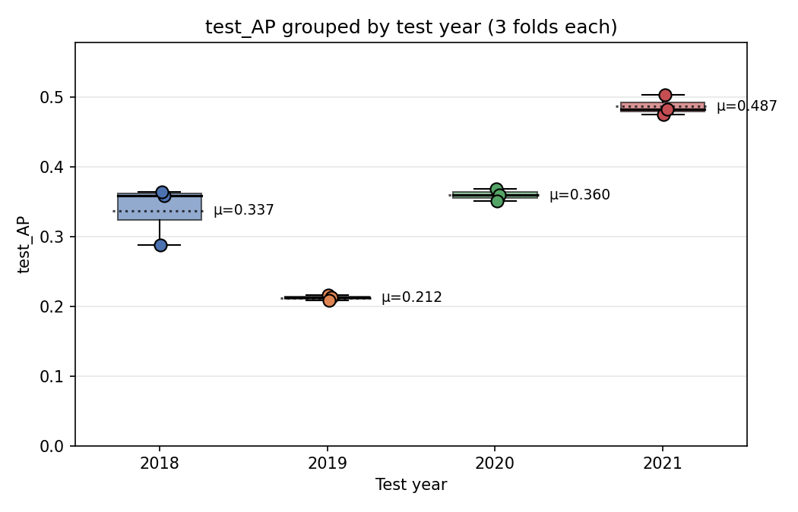
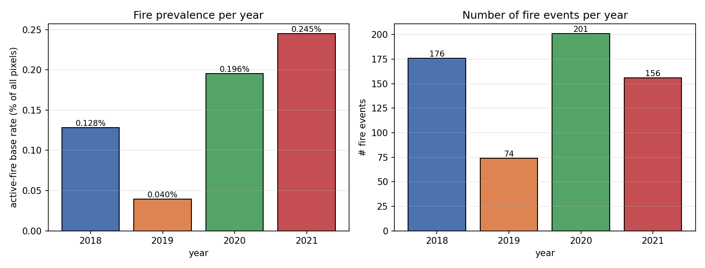
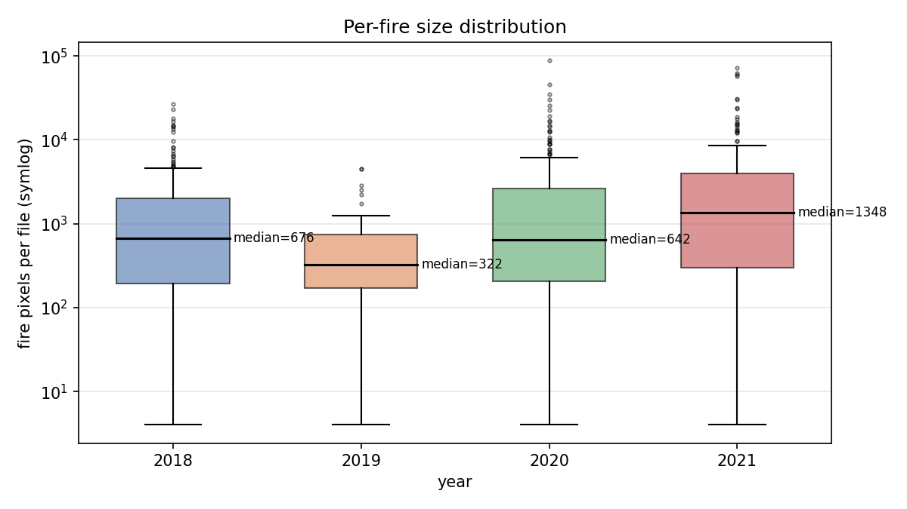
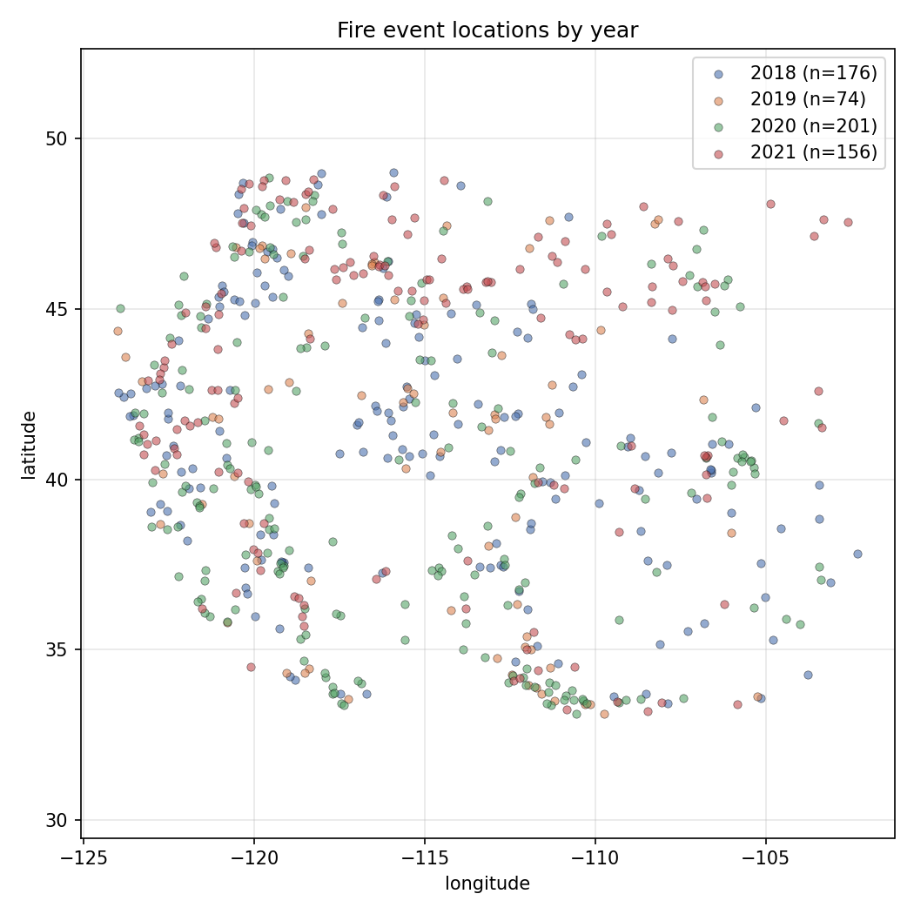
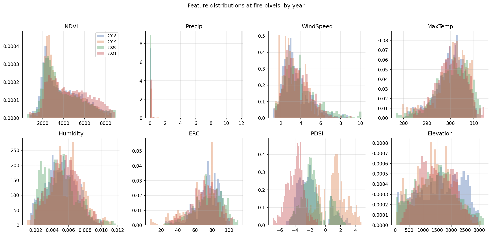
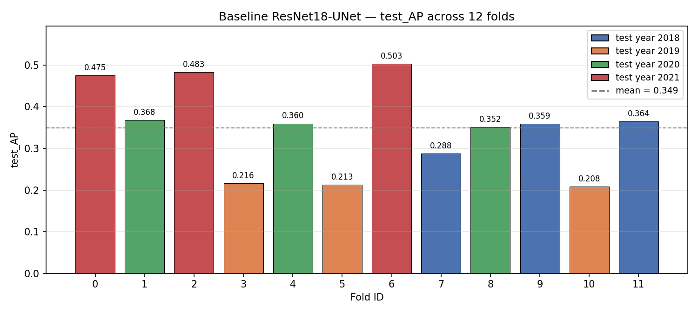
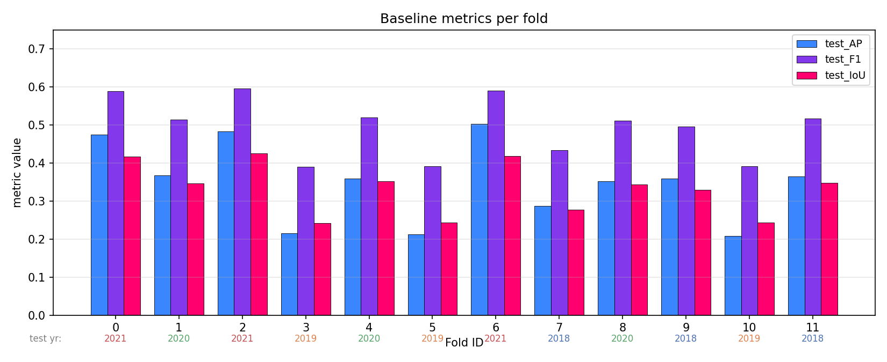
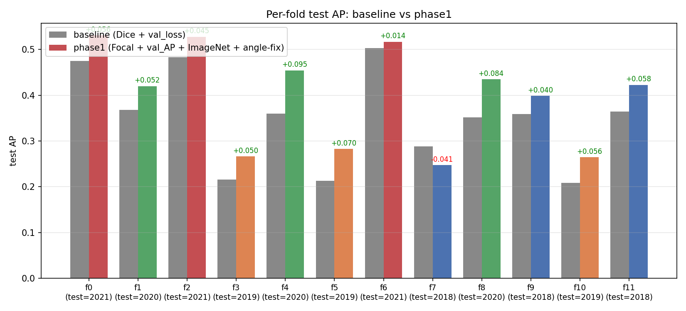
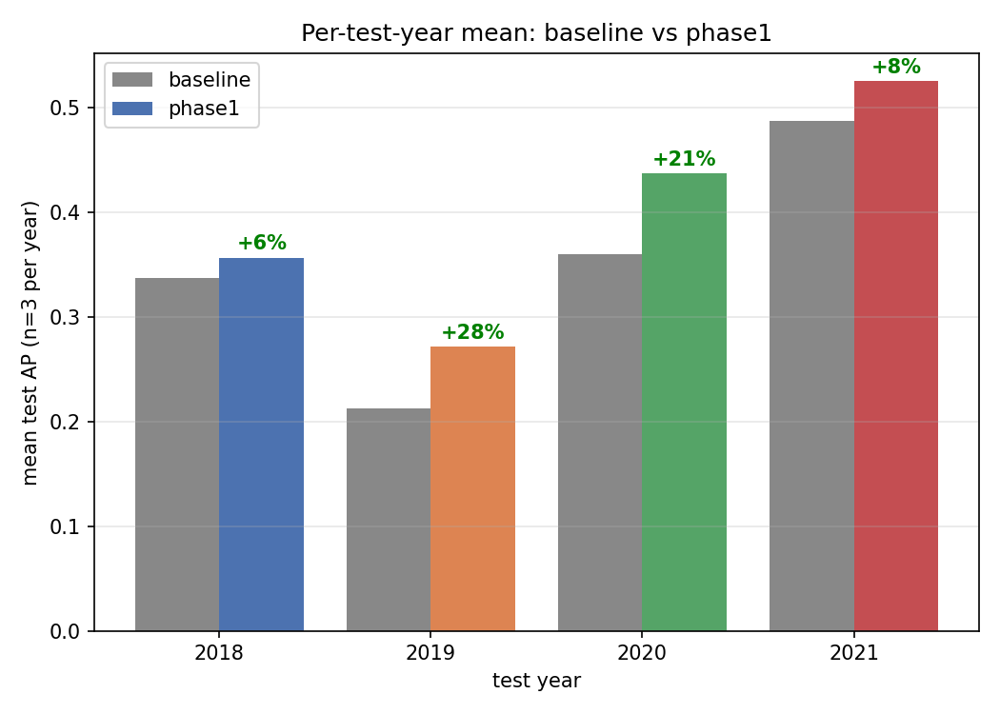
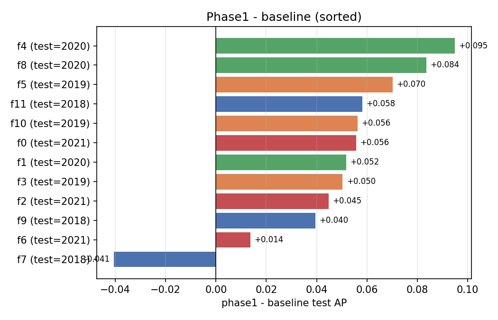

# Experiment Update — WildfireSpreadTS Baseline & Phase 0 EDA (2026-05-18)

**Author:** Erkang
**Compute:** AutoDL container, 1× RTX 4090
**Code:** `~/ECE228-Project-WildfirePredict` (commit on `main`)
**Raw artifacts:** `reports/figures/`, `reports/baseline_metrics.csv`, `reports/per_fire_stats.csv`, `reports/phase0_eda.json`

---

## TL;DR

- Finished baseline **ResNet18-UNet on all 12 data folds**. Mean test AP = **0.349 ± 0.104** (n=12).
- **Test-year choice dominates the variance — not the train-year combination.** Tested on 2021 → AP 0.487; tested on 2019 → AP 0.212 (2.3× gap).
- **Phase 0 EDA finds a concrete reason:** 2019 was a **quiet & wet** fire year (74 fires vs ~180, base rate 0.040% vs 0.13–0.25%, median fire size 322 px vs 642–1348 px). More importantly, **2019's PDSI distribution is essentially non-overlapping with 2021's** — the model trained on drought-year fires extrapolates poorly into the wet regime. This is a covariate-shift problem, not a model-capacity problem.
- The planned **FNO experiments did not run**: `cfgs/fno/fno_monotemporal.yaml` is referenced by `run_fno.sh` but does not exist. All three FNO logs are 20 lines of LightningCLI usage error.

---

## Task & dataset

### Task

Pixel-level **next-day active-fire mask prediction**. Given a stack of multimodal satellite + weather + topography rasters covering days `1..N` of a fire event, predict the binary active-fire mask for day `N+1`. Cast as **binary semantic segmentation**.

- Input: tensor of shape `(N, 40, H, W)` (40 channels after one-hot expanding land cover and adding a binary active-fire mask).
- Output: `(H, W)` binary mask.
- Per-pixel positive rate is **~1 in 230** even on the high-prevalence years — heavily imbalanced segmentation.

### Dataset (WildfireSpreadTS, Gerard et al., NeurIPS 2023 D&B)

- **Coverage:** 607 distinct fire events in the Western US (lng −125 to −103, lat 30 to 50, see *fig6*), 2018–2021. About 93 GB on disk after HDF5 conversion.
- **Storage:** one HDF5 file per fire event at `/root/autodl-tmp/wsts/data_hdf5/{year}/{fire_name}.hdf5`, with key `data` of shape `(T_days, 23_channels, H, W)`. Attributes: `fire_name`, `img_dates`, `lnglat`, `year`.
- **23 raw channels** (before model-time preprocessing):
  | idx | feature | type |
  |-----|---------|------|
  | 0–2 | VIIRS bands M11, I2, I1 | dynamic |
  | 3–4 | NDVI, EVI2 (vegetation) | dynamic |
  | 5   | Total precipitation | dynamic |
  | 6–7 | Wind speed, wind direction | dynamic |
  | 8–11 | Min/max temp, ERC (fire-weather), specific humidity | dynamic |
  | 12–14 | Slope, aspect, elevation | **static** |
  | 15 | PDSI (Palmer drought severity) | dynamic |
  | 16 | Landcover class (integer) | **static**, one-hot to 17 ch at train time |
  | 17–21 | 1-day forecasts: precip, wind speed/dir, temp, humidity | dynamic |
  | 22 | Active fire detection (hhmm encoding; >0 = fire) | dynamic, becomes target on day `N+1` |

  At training time, channel 16 is one-hot-expanded into 17 channels and a binarized active-fire mask is appended → **40 channels**.

- **Per-year counts (computed by `reports/eda_2019.py`)**

  | Year | # fires | total pixels | fire pixels | base rate | median fire size | mean fire size |
  |------|---------|--------------|-------------|-----------|------------------|----------------|
  | 2018 | 176 | 299 M | 384 K | 0.128 % | 676 px | 2 183 px |
  | **2019** | **74** | 115 M | **45 K** | **0.040 %** | **322 px** | **615 px** |
  | 2020 | 201 | 345 M | 675 K | 0.196 % | 642 px | 3 358 px |
  | 2021 | 156 | 316 M | 774 K | 0.245 % | 1 348 px | 4 962 px |

### Fold splits

`FireSpreadDataModule.split_fires` hard-codes 12 (train=2 yrs, val=1 yr, test=1 yr) permutations of {2018, 2019, 2020, 2021}. We ran all 12 for the baseline.

---

## What ran (baseline)

Twelve runs of `src/train.py` with:

```
--config=cfgs/unet/res18_monotemporal.yaml
--trainer=cfgs/trainer_single_gpu.yaml
--data=cfgs/data_monotemporal_full_features.yaml
--trainer.max_epochs=100 --seed_everything=0
--data.data_fold_id=0..11
```

Single-day input (`n_leading_observations=1`), all 40 features, crop 128×128, batch size 64, **Dice loss**, AdamW lr=1e-3, EarlyStopping on `val_loss` with patience 15.

Note: the SMP U-Net is currently initialized with **`encoder_weights=None`** (no ImageNet pretraining). This is left in `src/models/SMPModel.py` as-is from the upstream repo and is one of the cheapest wins to try next.

---

## Headline result — test-year effect



| Test year | n folds | mean test_AP | range            |
|-----------|---------|--------------|------------------|
| **2021**  | 3       | **0.487**    | 0.475 – 0.503    |
| 2020      | 3       | 0.360        | 0.352 – 0.368    |
| 2018      | 3       | 0.337        | 0.288 – 0.364    |
| **2019**  | 3       | **0.212**    | 0.208 – 0.216    |

Within-group spread is tiny (≤ 0.03 AP), between-group gap is huge. So:

- **Reporting the 12-fold mean is misleading.** Stratify by test year.
- **Training years matter less than the target year's distribution.** Folds 3, 5, 10 all test on 2019 and all score ~0.21 despite three different train sets.

---

## Phase 0 EDA — why is 2019 so much harder?

### 1. Fire prevalence is very different across years



- 2019 has roughly **half the fires** of the other years.
- 2019's active-fire base rate is **6× lower than 2021**. The Dice loss is much less effective when positives are this rare; this alone makes 2019 a harder learning target.

### 2. 2019's fires are smaller on average



Median fire size: 322 px in 2019 vs 642–1 348 px elsewhere. Small fires are dominated by edges, so per-pixel AP suffers more from any boundary error.

### 3. Geographic coverage is comparable across years



Fires from all four years span the same Western-US region. **Geographic shift is not the explanation.**

### 4. The smoking gun: PDSI distribution shift



Most channels (NDVI, wind speed, temperature, humidity, ERC, elevation) overlap heavily across years. **PDSI is the exception.**

| Year | typical PDSI at fire pixels |
|------|-----------------------------|
| 2018 | −2 to +1 (mild) |
| 2019 | **+1 to +4 (wet)** |
| 2020 | −3 to +1 (mild→dry) |
| 2021 | **−6 to −2 (severe drought)** |

PDSI is one of the 40 input channels. When a model is trained on (2018, 2020) and tested on 2019, **the test PDSI values are largely out-of-distribution.** Any decision rule the model learned that leans on PDSI as a "fire likelihood" signal will misfire. This is textbook **covariate shift**, and it explains both:

- why 2019 is consistently bad regardless of training fold, and
- why same-year folds are tightly clustered (the in-distribution generalization within a year is actually fine).

---

## Per-fold breakdown



Color = test year. Within-color spread is tiny, between-color spread is the entire story.



AP, F1, IoU rank folds in the same order — the test-year effect is not an AP artifact, it shows up in every threshold-based metric. `test_recall` and `test_precision` are in `reports/baseline_metrics.csv`.

---

## What didn't run (and why)

**FNO baseline (`run_fno.sh`).** All three folds (0, 5, 10) failed in <1 s with:

```
train.py: error: Parser key "config":
File does not exist: /root/ECE228-Project-WildfirePredict/cfgs/fno/fno_monotemporal.yaml
```

The script references a config that was never created. Before retrying:

1. Add `cfgs/fno/fno_monotemporal.yaml` pointing at an FNO model class.
2. Either implement an `FNOLightning` in `src/models/` and register it, or pull in `neuraloperator`'s `FNO2d`.

Note: FNO is theoretically a poor fit here (the task is local, sparse, and uses one-hot categorical inputs, all of which conflict with FFT's smoothness assumptions). A more promising direction is **UNet with a small Fourier bottleneck** — keeps local convolutional inductive bias, adds global coupling only at the deepest scale.

---

## Recommended next steps

Updated based on EDA. In rough priority order:

1. **Fix the angle-feature bug first.** `FireSpreadDataset.py:339` transforms wind direction / aspect with only `sin()`, collapsing 90° and −90° to the same value. This is a correctness bug that is silently degrading the baseline. ~10 lines to fix; will require re-running everything once.
2. **Encoder pretraining (cheapest win).** Set `encoder_weights="imagenet"` in `SMPModel.__init__`. SMP handles `in_channels != 3` automatically. Re-run fold 0 (easy) and fold 3 (hard); 20–30 min each. Validates the "free AP" hypothesis.
3. **Address PDSI covariate shift (biggest expected win on 2019).** Three escalating options:
    - (a) Drop PDSI from the feature set (`--data.features_to_keep`), see if 2019 stops being an outlier.
    - (b) Per-year PDSI standardization in the dataset (subtract year-mean, divide by year-std), to neutralize the distribution shift.
    - (c) Domain-adversarial training (DANN-style) treating year as the domain.
    Option (a) is the cleanest sanity check and the cheapest.
4. **Class-imbalance handling on low-base-rate folds.** Switch `loss_function` to `Focal` (uses `pos_class_weight = 236`), possibly with a class-balanced sampler. Most likely to help fold 3/5/10 (test = 2019).
5. **Report metrics stratified by test year**, not just the 12-fold mean. The mean is genuinely misleading here.
6. **Multi-temporal U-Net** (`--data.n_leading_observations=5`) — paper-validated direction, easy to launch.
7. **Decide on FNO scope.** Either build the missing config and an `FNOLightning` (and accept the likely poor result as a documented finding), or remove `run_fno.sh` to stop misleading future contributors.

---

## Phase 1 — what we changed and what happened (update 2026-05-21)

After the Phase 0 EDA we landed four code changes (one bug fix, three modeling tweaks) and reran the full 12-fold sweep. All edits live alongside the originals as `.bak` files in `src/`.

### Changes

| # | File | Change | Why |
|---|------|--------|-----|
| 1 | `src/dataloader/FireSpreadDataset.py` | sin-only angle encoding to cyclic (sin, cos). 3 extra channels appended after the standardization step; `get_n_features` and the static/dynamic ID split updated; total input channels 40 to 43. | Bug: `sin(deg)` alone is non-injective (90 deg and 90-deg-mirror collapsed). Now wind direction, aspect, forecast wind direction each get a (sin, cos) pair. |
| 2 | `src/models/SMPModel.py` | `encoder_weights=None` to `"imagenet"`. SMP auto-handles `in_channels=43 != 3`. | Free initialization signal; the original repo had pretraining disabled. |
| 3 | `cfgs/unet/res18_monotemporal.yaml` + `src/models/BaseModel.py` | `loss_function: Dice` to `Focal`. Fixed `compute_loss` Focal branch: `alpha = pw/(1+pw) ~ 0.996` (was `1 - pw/(1+pw) ~ 0.004` due to a flipped formula, which made the model collapse to all-negatives in early sweep attempts). Also added shape-matching for y/y_hat. | WSTS+ paper ablation: removing Focal costs them 24 % AP. With the original alpha it actively hurt; with the corrected formula it works as advertised. |
| 4 | `cfgs/trainer_single_gpu.yaml` + `src/models/BaseModel.py` | EarlyStopping + ModelCheckpoint switched from `val_loss` (min) to `val_AP` (max). Added `val_avg_precision` torchmetric and logged it from `validation_step`. | WSTS+ ablation: monitoring `val_loss` instead of `val_AP` costs 29 % AP. |
| - | `src/dataloader/FireSpreadDataModule.py` | All 4 `DataLoader` calls: `persistent_workers=True`, `prefetch_factor=2`. | Operational: with the default `num_workers=8` workers were dying mid-training and silently killing folds. `num_workers=2` + persistent workers is the safe combo on the AutoDL container. |

### Result (all 12 folds, same year splits, same compute)



| Fold | test year | baseline_AP | phase1_AP | Delta |
|------|-----------|-------------|-----------|-------|
| 0  | 2021 | 0.475 | **0.531** | +11.7 % |
| 1  | 2020 | 0.368 | **0.420** | +14.1 % |
| 2  | 2021 | 0.483 | **0.528** | +9.3 % |
| 3  | 2019 | 0.216 | **0.266** | +23.3 % |
| 4  | 2020 | 0.360 | **0.454** | +26.4 % |
| 5  | 2019 | 0.213 | **0.283** | +33.1 % |
| 6  | 2021 | 0.503 | **0.517** | +2.7 % |
| 7  | 2018 | 0.288 | 0.247 | **-14.1 %** |
| 8  | 2020 | 0.352 | **0.435** | +23.8 % |
| 9  | 2018 | 0.359 | **0.399** | +11.0 % |
| 10 | 2019 | 0.208 | **0.265** | +27.0 % |
| 11 | 2018 | 0.364 | **0.423** | +16.0 % |

**12-fold mean: 0.349 to 0.397 (+15.4 %).** 11/12 folds positive, one regression (fold 7).

### Per-test-year stratified



| Test year | baseline mean | phase1 mean | Delta |
|-----------|---------------|-------------|-------|
| 2018 | 0.337 | 0.356 | +5.7 % |
| **2019** | **0.212** | **0.271** | **+27.8 %** |
| 2020 | 0.360 | 0.437 | +21.3 % |
| 2021 | 0.487 | 0.525 | +7.8 % |

The **2019 lift (+27.8 %) is the headline.** That was the year the EDA pinned as protected by PDSI distribution shift; even though we did nothing PDSI-specific, Focal + AP-monitoring + better init lifted it substantially. 2019 still has the lowest absolute AP though - the covariate-shift ceiling is real.

### Where val_AP and test_AP diverged

Fold 3 (train=2018,2020; val=2021; test=2019) reached **val_AP 0.544** at epoch 33 but **test_AP only 0.266**. The val/test gap is exactly the PDSI shift we'd predicted: validation set is 2021 (drought), test is 2019 (wet), checkpoint selected on val overfits the validation regime. Same pattern in fold 5 (val_AP 0.449 to test 0.283) and fold 10 (val_AP 0.442 to test 0.265). **Selecting checkpoints on val_AP is now improving things, but val_AP itself is no longer a clean proxy for test_AP on the 2019 folds.**



### Bugs surfaced (and fixed)

1. **Focal `alpha` formula was inverted in the original repo** (`alpha=1-pos_class_weight` after the `pw /= 1+pw` normalization). With our `pos_class_weight=236`, this gave `alpha ~ 0.004` - positives weighted 0.4 %, negatives 99.6 %. Model collapsed to predicting all-negatives, loss went to ~1e-4, val_AP stayed at base rate. Replaced with `alpha = pw/(1+pw) ~ 0.996` so positives dominate the loss. This was probably never noticed because the Dice path was the default.
2. **DataLoader workers crash silently with `num_workers=8`** on this dataset/container combo. The pipe through `tee` swallowed the traceback (`torch.utils.data._utils.signal_handling._error_if_any_worker_fails`) so each fold appeared to finish in 1-6 min with empty `test_AP`. `num_workers=2` + `persistent_workers=True` is stable.

### Recommended next steps (updated)

1. **PDSI handling - now the dominant ceiling.** EDA + the fold-3 val/test gap both say the same thing. Try in order: drop PDSI channel; per-year standardize PDSI; DANN-style year-domain adversarial training.
2. **Multi-temporal U-Net** (`--data.n_leading_observations=5`) - independent axis, paper-validated direction.
3. **Investigate fold 7 regression.** It's the only regression, was also a low outlier in baseline. May respond to seed averaging or a lower learning rate.
4. **Try the WSTS+ paper's UTAE temporal-self-attention setup** (their best at 0.478 AP). Requires implementing or pulling in `LTAE`.
5. Long-term: if 2019 is still the bottleneck after PDSI handling, the dataset itself (only 74 fires) may need augmentation/oversampling.

## Reproducing

```bash
source /root/autodl-tmp/wsts/venv/bin/activate
source /etc/network_turbo
cd /root/ECE228-Project-WildfirePredict
python reports/analyze_experiments.py   # → figs 1–3 from baseline logs
python reports/eda_2019.py              # → figs 4–7 from HDF5 data (~4 min)
```

Outputs are regenerated under `reports/` from the raw logs in `/root/autodl-tmp/wsts/logs/baseline_fold*.log` and the HDF5 dataset at `/root/autodl-tmp/wsts/data_hdf5/`.
